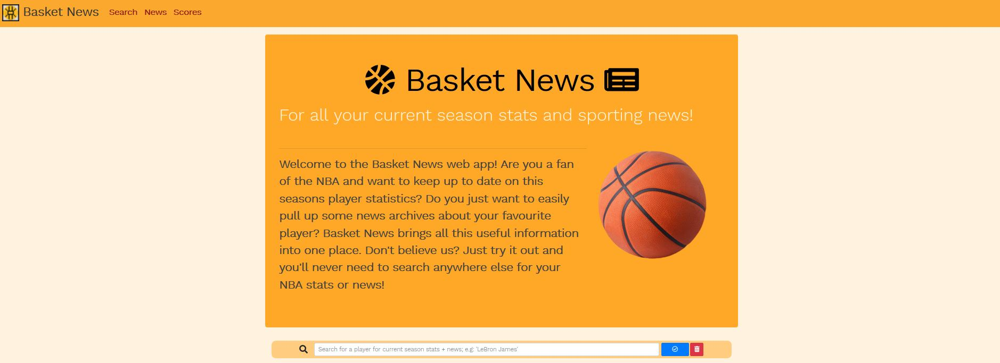
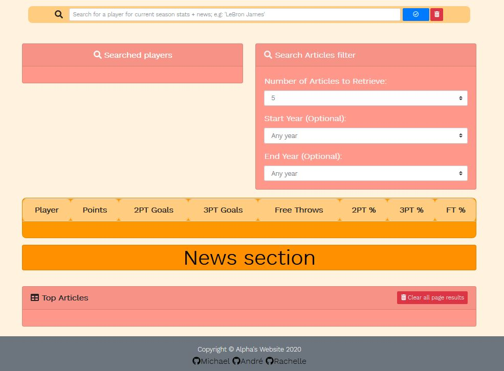
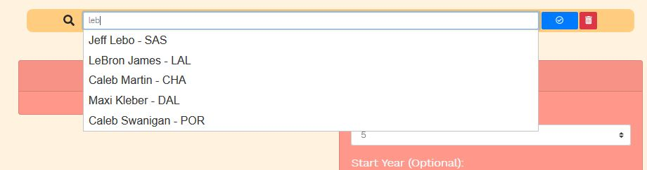
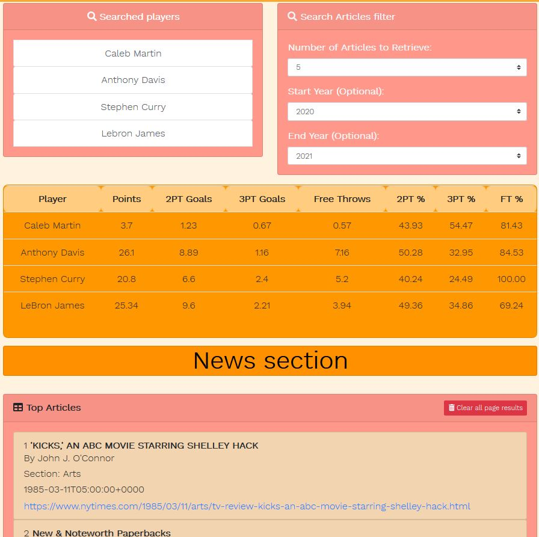
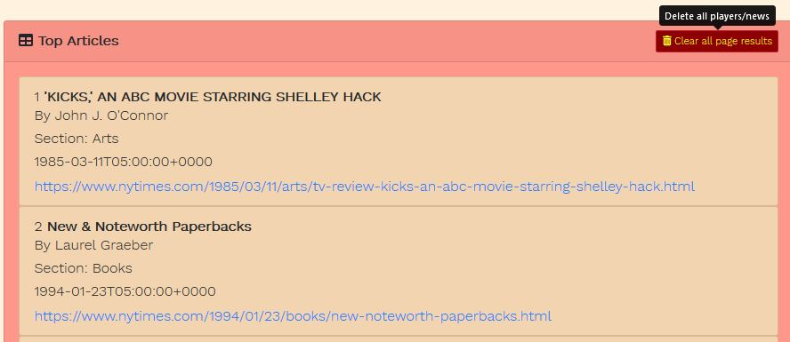

# Project-1 Basketball & News

## Basket News

This application will display statistics and information from the NBA by using the NYT Article Search API and the BallDontLie API, integrating data from the latter to search for news articles on the sports desk.

We hope the convenience of being able to monitor your favourite players and keep track of the current (or past) news pertaining to NBA players past and present.

### Contents

- index.html
- script.js
- style.css
- img folder with assets

### User Story

This application uses the AJAX with 'www.balldontlie.io' API to recover information in the JSON. HTML and CSS driven by jQuery we can show the user the following data:

    As a user,
    I WANT TO search for NBA players,
    SO I CAN see current season statistics and,
    SO I CAN view news (past and present) about them.
    I WANT TO see their season averages in a table,
    SO THAT I can compare it to other players that season.

    As a user,
    I WANT TO conveniently select previous searches,
    SO I CAN see different player news WITHOUT changing my table

### Design Phase

_Basic scaffold of API integration. Primary focus was BallDontLie.io fetch and data integration_

### Final Interface

_Initial landing page with fixed navbar_

_Search bar, article filter, season stats tables and news section_

_Autocomplete typeahead connected to ballDontLie API_

_Rendered data from searches_

_Clear button to empty local storage and remove data_

### Demonstration

Deployed on Github pages: https://agr2020xman.github.io/Project_1-Basketball-News/

#### APIs + Tools

- [NYT Article Search!](https://developer.nytimes.com/docs/articlesearch-product/1/overview)
- [ballDontLie.io!](https://www.balldontlie.io/#introduction)
- [jQueryUI!](https://jqueryui.com/autocomplete/)
- [VScode](https://code.visualstudio.com/) - The editor of choice.
- [jQuery](https://api.jquery.com/)
- [HTML](https://developer.mozilla.org/en-US/docs/Web/HTML)
- [Bootstrap](https://getbootstrap.com/)

##### Authors

_Michael Watt_

- [Github!](https://github.com/Michaelmw17)
- [LinkedIn!](https://www.linkedin.com/in/michael-watt-6a76961b3/)
- [Portfolio!](http://michaelmw17.github.io/)
- Email:(michaelmw17@outlook.com)

_Andr&eacute; Grech_

- [Github!](https://github.com/AGr2020Xman)
- [LinkedIn!](https://www.linkedin.com/in/andregrech95/)
- [Portfolio!](https://agr2020xman.github.io/Homework_Week_2/)
- Email:(silver.grech@gmail.com)

_Rachelle_

- [Github!](https://github.com/rachellebarredo)
- [Portfolio!](http://rachellebarredo.github.io/)
- Email:(rachellebarredo94@gmail.com)

##### License 

- [MIT License](https://opensource.org/licenses/MIT)

##### Acknowledgments

- 2019 Trilogy Education Services, a 2U, Inc. brand. All Rights Reserved.
